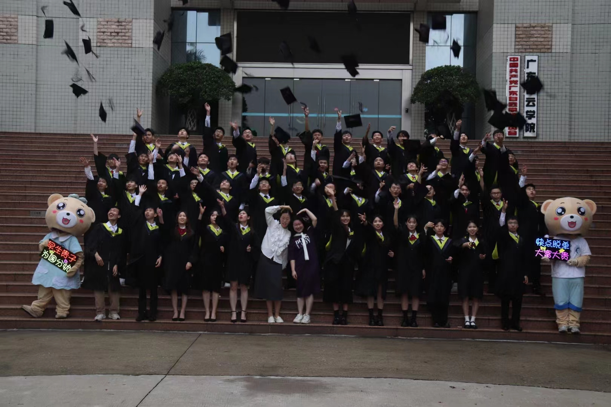
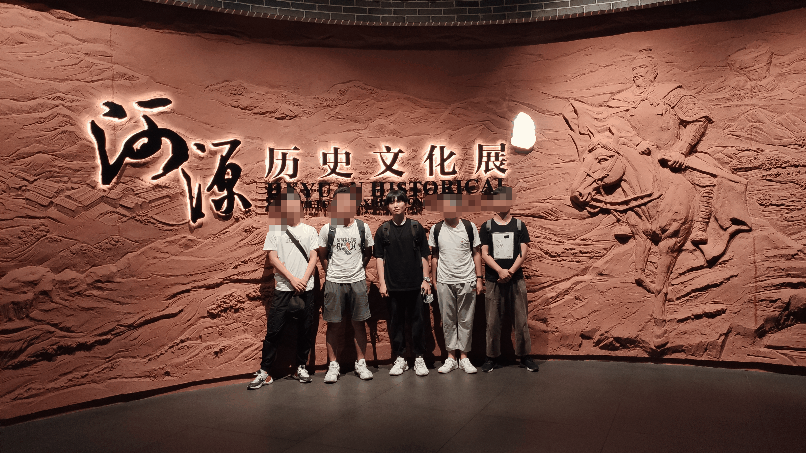
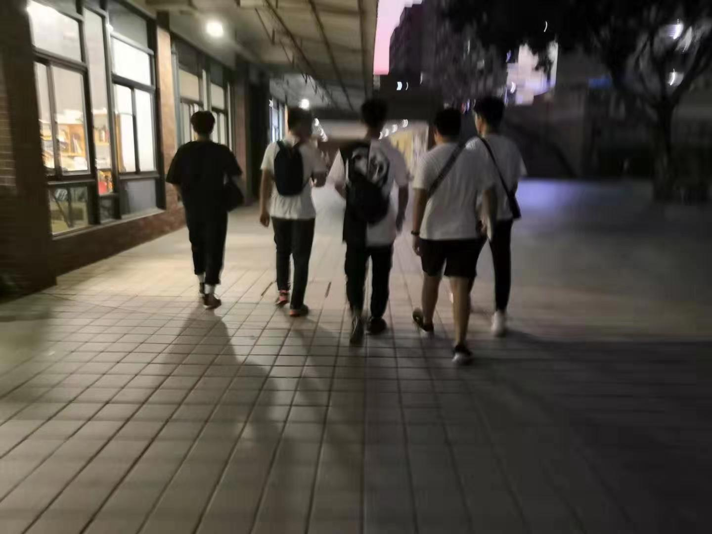
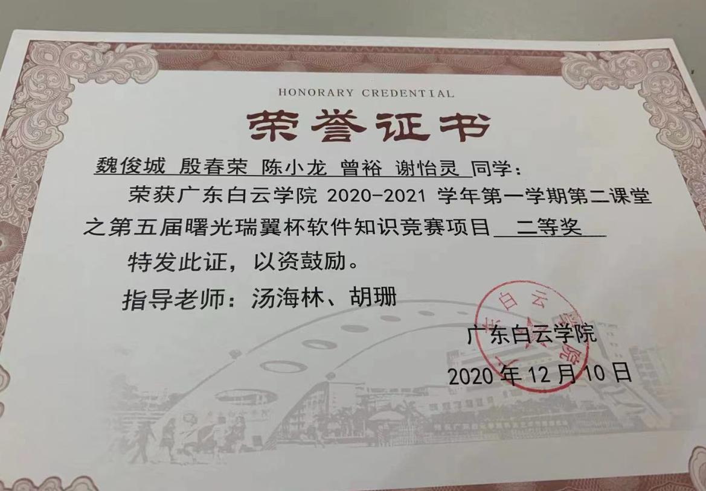
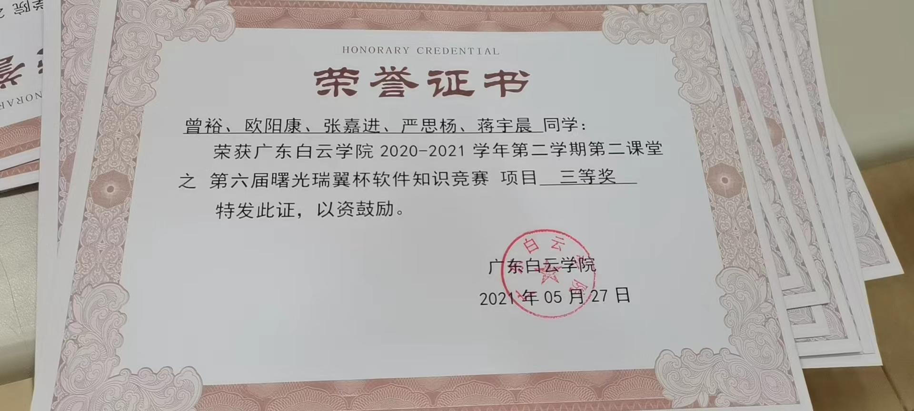

## 2025.01-24 留

大家好呀 我工作是前端开发的工程师到，到现在已有 1 年实习经验 2 年正式工作经验也算有 3 年经验了，想记录点自己的工作心得，不是啥高大上的内容 ，这些博客是我对平时工作用到的部分解决方案记录，再到项目中踩过的技术坑及解决方案，每一篇都源于我的实际工作积累，我始终相信，想要进步是需要靠持续复盘与分享的

---

## 下面是毕业前写的记录 有点文青病 留着作纪念吧

2023.04-15 留

> 少年好学，如日出之阳；壮年好学，如日中之光；老而好学，如秉烛之明。
> 自尊不可自大，自谦不可自卑。

你好，我是一个 2002 年 10 月出生 **2023 届即将毕业**的软件工程专业的学生，上学的那段时间
我和身边的朋友也玩得很好而我当时也比较安静，理所应当我也有了不少兴趣
在这里分享一下我是怎么样的人

### 喜欢听歌

> "音乐是上天给人类最伟大的礼物，只有音乐能够说明安静和静穆"

无论是在玩游戏或者在写代码，我都喜欢听音乐 音乐令人镇静放松 能提高工作效率与学习效率
民谣、摇滚、流行、电音、纯音乐 无论是中英文 都有涉猎

| 喜欢的歌手  |     最爱的歌      |
| :---------: | :---------------: |
|  ColdPlay   |      Fix You      |
| KingCrimson |      Epitaph      |
|   Rainbow   | Catch The Rainbow |
|    陈粒     |       走马        |
|   陈鸿宇    |       途中        |
|     ...     |        ...        |

<a href="https://www.bilibili.com/video/BV17U4y1u7HY/?spm_id_from=333.337.search-card.all.click">我很喜欢的一首歌</a>

### 喜欢看书

> 在浩瀚的知识面前，深感浅薄；因为身体抵达不了的地方，读书可以；因为灵魂需要独处，而独处的最好方式是——读书

在高中我就喜欢阅读一些文学作品比如：鲁迅、张爱玲、雨果、简·奥斯汀等作家的作品
在看书的时候 人是极度放松的 沉浸在知识的海洋是世界上最美好的事情之一
**_脚步丈量不到的地方，文字可以。_**
`《呐喊》、《堂吉诃德》、《百年孤独》、《红楼梦》、《悲惨世界》、《傲慢与偏见》...`

### 喜欢学习

> "人有知学 则有力矣"

对知识的探索是从小到大养成的习惯、无论是各种知识、专业与不专业 只要提起了兴趣就会去了解
在实习工作期间 每当下班或者周末有空时候 在娱乐完都会学习新知识 为了适应工作要求 又或者
为了提升自己的竞争力 也会去学习新的技术 即便不是学习技术 也会看很多科教或者历史纪录片

```
学习不仅仅是读书——须知“世事洞明皆学问，人情练达即文章”。并非是圣贤之书读得越多
```

### 大学的一些生活照

> 就好像最终我们都会消失在人海里...

<div style="display:flex;width:100%;flex-wrap:wrap">


> 和舍友一起去博物馆玩
> 

> 和舍友一起去吃饭
> 

> 软件设计师
> 

> 学校竞赛的奖状
>  > 

### .....

</div>
